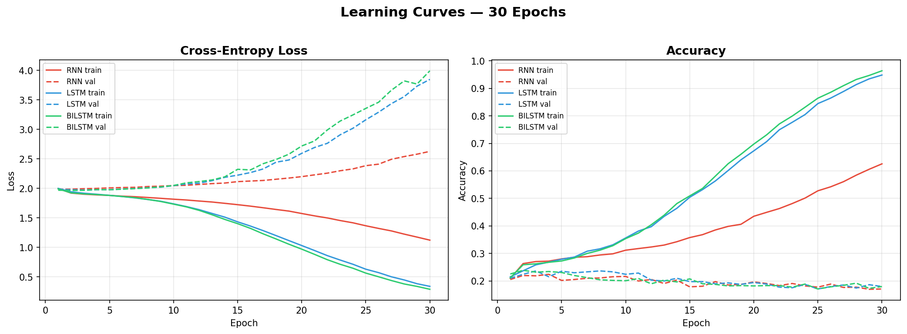
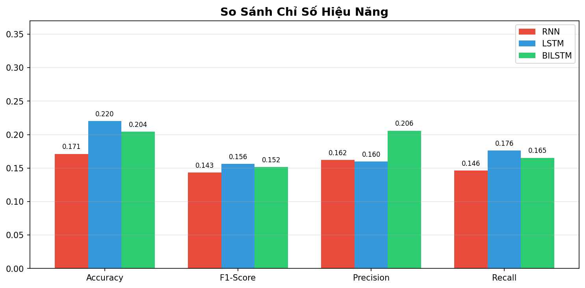
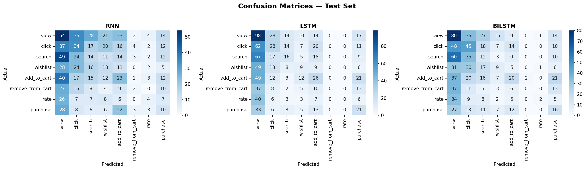
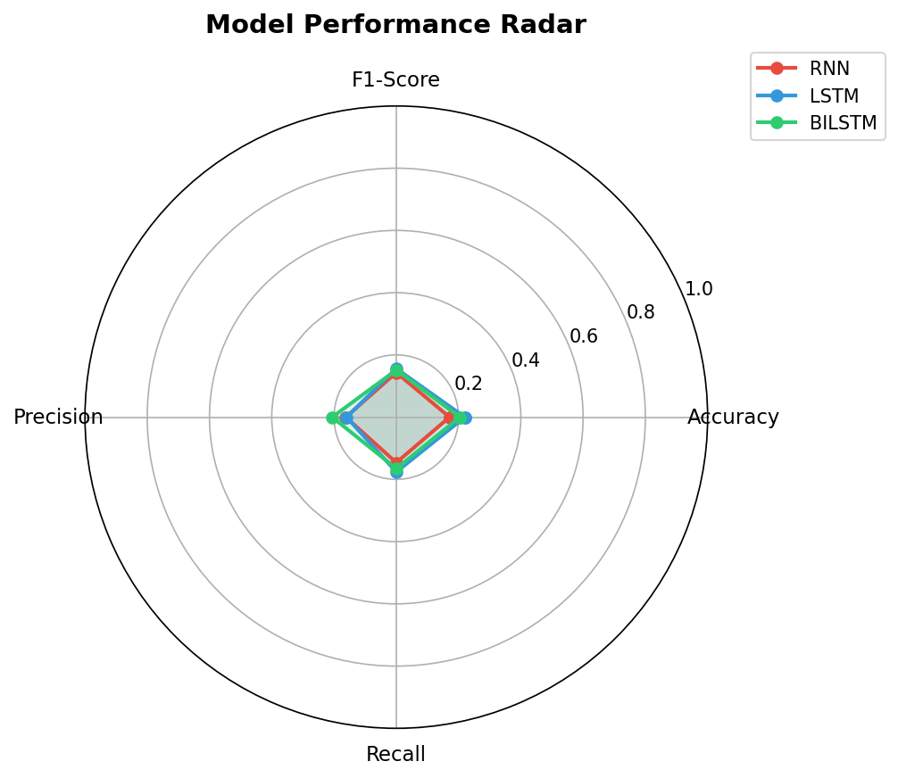

# 3. Câu 2a — Deep Learning: RNN / LSTM / BiLSTM

## 3.1 Giải Thích Mô Hình

Bài toán được xây dựng là **phân loại hành vi người dùng (User Behavior Classification)** dựa trên chuỗi sản phẩm đã tương tác. Mỗi user được mã hóa thành một sequence các `product_id` + `action`, nhãn (label) là **hành vi tại thời điểm kế tiếp** của chuỗi — tổng cộng **8 classes**:

> `view` · `click` · `search` · `wishlist` · `add_to_cart` · `remove_from_cart` · `rate` · `purchase`

### Kiến trúc chung của 3 mô hình

```
Input (product_seq + action_seq)
  → Product Embedding (n_products × 64) + Action Embedding (n_actions × 32)
  → Concat → Recurrent Layer (RNN / LSTM / BiLSTM, hidden=128)
  → Fully Connected Layer → Softmax (8 classes)
```

- **RNN (Recurrent Neural Network):** Xử lý tuần tự từng bước trong sequence. Đơn giản nhất nhưng dễ bị vanishing gradient với sequence dài.
- **LSTM (Long Short-Term Memory):** Thêm cơ chế Forget Gate, Input Gate, Output Gate giúp nhớ được ngữ cảnh dài hạn. Khắc phục vanishing gradient.
- **BiLSTM (Bidirectional LSTM):** Chạy LSTM theo cả hai chiều (forward + backward). Nắm bắt được ngữ cảnh trước VÀ sau trong chuỗi hành vi người dùng, lý thuyết cho hiệu năng cao nhất.

### Thông số huấn luyện

| Tham số | Giá trị |
|---|---|
| Embedding dim (product) | 64 |
| Embedding dim (action) | 32 |
| Hidden size | 128 |
| Window size | 8 |
| Epochs | 30 |
| Batch size | 256 |
| Learning rate | 1e-3 |
| Optimizer | Adam |
| Loss function | CrossEntropyLoss |
| Split (user-based) | 80% train / 10% val / 10% test |

### Dữ liệu

- **Nguồn:** `data_user500.csv` (500 users, ~13.000 interactions)
- **Tổng samples sau windowing:** 9.000
- **Train:** 7.200 samples (400 users) · **Val:** 900 samples (50 users) · **Test:** 900 samples (50 users)
- Chia theo user (user-based split) để tránh data leakage

---

## 3.2 Kết Quả Đánh Giá Mô Hình

### Learning Curves — Quá Trình Huấn Luyện (30 Epochs)



*Hình 4.1: Learning Curves — Cross-Entropy Loss và Accuracy qua 30 epochs. Cả 3 mô hình đều cho thấy train loss giảm mạnh trong khi val loss tăng dần sau epoch ~10, cho thấy hiện tượng overfitting. BiLSTM train loss giảm mạnh nhất nhưng val loss tăng nhiều nhất.*

### So Sánh Các Chỉ Số Hiệu Năng



*Hình 4.2: So sánh Accuracy, F1-Score, Precision, Recall của 3 mô hình trên tập test.*

### Ma Trận Nhầm Lẫn — Confusion Matrices



*Hình 4.3: Confusion Matrices của RNN (Acc=0.171, F1=0.143), LSTM (Acc=0.220, F1=0.156), BiLSTM (Acc=0.204, F1=0.152). Cả 3 mô hình có xu hướng dự đoán nhãn "view" (dominant class) chiếm đa số.*

### Radar Chart — Tổng Hợp Hiệu Năng



*Hình 4.4: Model Performance Radar — Mô hình tốt nhất được chọn là LSTM dựa trên F1-Score tổng hợp (macro).*

---

## 3.3 Bảng So Sánh Số Liệu

| Model | Accuracy | F1-Score | Precision | Recall |
|:---|:---:|:---:|:---:|:---:|
| RNN | 0.171 | 0.143 | 0.162 | 0.146 |
| **LSTM** ⭐ Best | **0.220** | **0.156** | 0.160 | **0.176** |
| BiLSTM | 0.204 | 0.152 | **0.206** | 0.165 |

*Bảng 4.1: So sánh hiệu năng 3 mô hình trên tập test (macro averaging)*

---

## 3.4 Nhận Xét & Chọn Mô Hình Tốt Nhất

Kết quả thực nghiệm cho thấy **LSTM đạt F1-Score cao nhất (0.156)** và được chọn là `model_best`.

- **Accuracy:** LSTM đạt cao nhất (0.220), tiếp theo là BiLSTM (0.204) và RNN (0.171).
- **F1-Score (macro):** LSTM (0.156) > BiLSTM (0.152) > RNN (0.143) — LSTM vượt trội.
- **Precision:** BiLSTM đạt precision cao nhất (0.206) nhờ phân phối dự đoán đa dạng hơn, nhưng recall thấp hơn LSTM.
- **Recall:** LSTM (0.176) > BiLSTM (0.165) > RNN (0.146) — LSTM nhận diện được nhiều lớp hành vi hơn.

### Nguyên nhân hiệu năng thấp

1. **Mất cân bằng lớp nghiêm trọng:** Hành vi `"view"` chiếm đa số trong dữ liệu. Tất cả các mô hình đều có xu hướng thiên vị dự đoán về nhãn này (quan sát từ Confusion Matrix).
2. **Overfitting:** BiLSTM có nhiều tham số nhất, train accuracy đạt >96% nhưng val accuracy chỉ ~18%, cho thấy overfitting nặng trên bộ dữ liệu nhỏ (9.000 samples). LSTM và RNN cũng gặp hiện tượng tương tự nhưng nhẹ hơn.
3. **Dữ liệu giới hạn:** Với chỉ 500 users và 50 products, không gian hành vi khá hạn chế. Mô hình phức tạp hơn (BiLSTM) không mang lại lợi thế rõ ràng so với LSTM đơn giản.

### Model được lưu

```
ai-service/models/dl/model_best.pt          ← LSTM checkpoint (best F1)
ai-service/models/dl/rnn_classification.pt   ← RNN checkpoint
ai-service/models/dl/lstm_classification.pt  ← LSTM checkpoint
ai-service/models/dl/bilstm_classification.pt ← BiLSTM checkpoint
ai-service/reports/deep_learning/metrics.json ← Toàn bộ metrics chi tiết
```

---

## 3.5 Code Nguồn Chính (PyTorch)

### Định nghĩa 3 mô hình: `ai-service/api/dl_models.py`

```python
from __future__ import annotations
import torch
import torch.nn as nn


class BehaviorRNN(nn.Module):
    """Simple RNN: Embedding → SimpleRNN → FC Layer"""

    def __init__(self, n_products, n_actions, emb_dim=64, hidden=128,
                 n_classes=None, task="next_item"):
        super().__init__()
        self.task = task
        self.product_emb = nn.Embedding(n_products, emb_dim, padding_idx=0)
        self.action_emb = nn.Embedding(n_actions, emb_dim // 2, padding_idx=0)
        self.rnn = nn.RNN(
            input_size=emb_dim + emb_dim // 2,
            hidden_size=hidden, batch_first=True,
        )
        if task == "classification" and n_classes is not None:
            self.head = nn.Linear(hidden, n_classes)
        else:
            self.head = nn.Linear(hidden, n_products)

    def forward(self, product_seq, action_seq):
        p = self.product_emb(product_seq)
        a = self.action_emb(action_seq)
        x = torch.cat([p, a], dim=-1)
        out, _ = self.rnn(x)
        last = out[:, -1, :]
        return self.head(last)


class BehaviorLSTM(nn.Module):
    """LSTM: Embedding → LSTM → FC Layer"""

    def __init__(self, n_products, n_actions, emb_dim=64, hidden=128,
                 n_classes=None, task="next_item"):
        super().__init__()
        self.task = task
        self.product_emb = nn.Embedding(n_products, emb_dim, padding_idx=0)
        self.action_emb = nn.Embedding(n_actions, emb_dim // 2, padding_idx=0)
        self.lstm = nn.LSTM(
            input_size=emb_dim + emb_dim // 2,
            hidden_size=hidden, batch_first=True,
        )
        if task == "classification" and n_classes is not None:
            self.head = nn.Linear(hidden, n_classes)
        else:
            self.head = nn.Linear(hidden, n_products)

    def forward(self, product_seq, action_seq):
        p = self.product_emb(product_seq)
        a = self.action_emb(action_seq)
        x = torch.cat([p, a], dim=-1)
        out, _ = self.lstm(x)
        last = out[:, -1, :]
        return self.head(last)


class BehaviorBiLSTM(nn.Module):
    """Bidirectional LSTM: Embedding → BiLSTM → FC Layer"""

    def __init__(self, n_products, n_actions, emb_dim=64, hidden=128,
                 n_classes=None, task="next_item"):
        super().__init__()
        self.task = task
        self.product_emb = nn.Embedding(n_products, emb_dim, padding_idx=0)
        self.action_emb = nn.Embedding(n_actions, emb_dim // 2, padding_idx=0)
        self.bilstm = nn.LSTM(
            input_size=emb_dim + emb_dim // 2,
            hidden_size=hidden, batch_first=True,
            bidirectional=True,
        )
        # BiLSTM output is 2 * hidden
        fc_input = hidden * 2
        if task == "classification" and n_classes is not None:
            self.head = nn.Linear(fc_input, n_classes)
        else:
            self.head = nn.Linear(fc_input, n_products)

    def forward(self, product_seq, action_seq):
        p = self.product_emb(product_seq)
        a = self.action_emb(action_seq)
        x = torch.cat([p, a], dim=-1)
        out, _ = self.bilstm(x)
        last = out[:, -1, :]
        return self.head(last)


# Factory
MODEL_REGISTRY = {"rnn": BehaviorRNN, "lstm": BehaviorLSTM, "bilstm": BehaviorBiLSTM}

def build_model(model_type, n_products, n_actions, emb_dim=64, hidden=128,
                n_classes=None, task="next_item"):
    cls = MODEL_REGISTRY[model_type.lower()]
    return cls(n_products=n_products, n_actions=n_actions, emb_dim=emb_dim,
               hidden=hidden, n_classes=n_classes, task=task)
```

### Script Train & Eval: `ai-service/scripts/train_eval_classification.py`

```bash
# Chạy pipeline đầy đủ
python scripts/train_eval_classification.py --source csv --epochs 30

# Tuỳ chỉnh
python scripts/train_eval_classification.py \
  --source csv \
  --csv data_user500.csv \
  --window 8 \
  --epochs 30 \
  --batch-size 256 \
  --lr 1e-3 \
  --models rnn lstm bilstm
```

**Output sinh ra:**
- `models/dl/*.pt` — weights cho từng model + `model_best.pt`
- `reports/deep_learning/metrics.json` — toàn bộ số liệu đánh giá
- `reports/deep_learning/*.png` — 4 biểu đồ (learning curves, metrics comparison, confusion matrices, radar chart)
