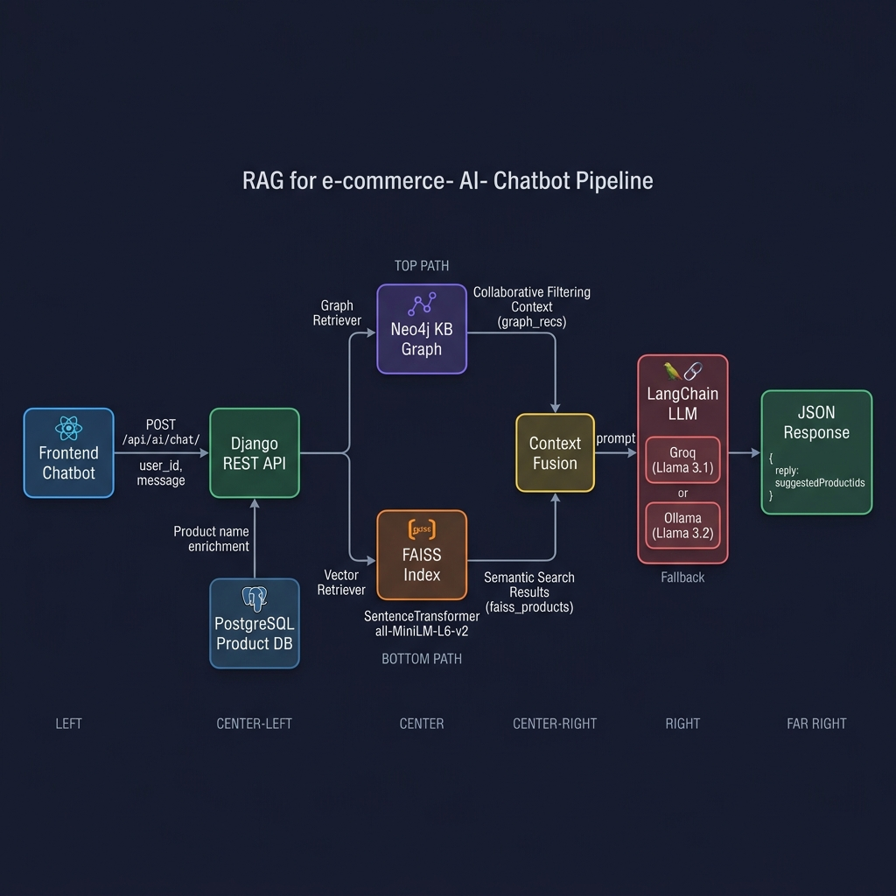
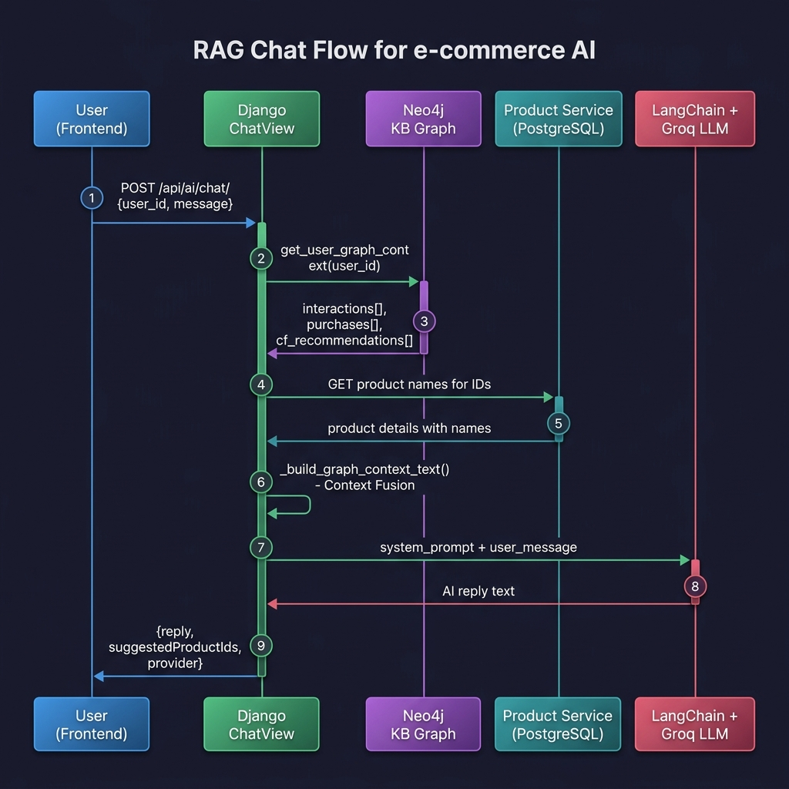
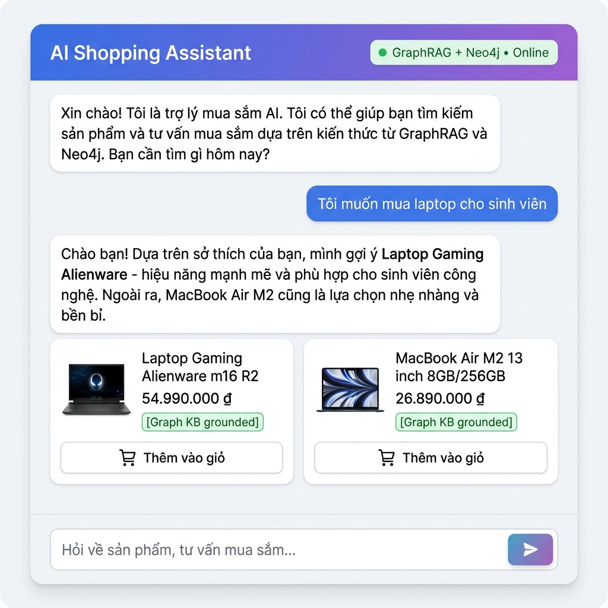

# 5. Câu 2c — RAG Tích Hợp KB Graph

## 5.1 Kiến Trúc RAG Pipeline

Hệ thống sử dụng kỹ thuật **RAG (Retrieval-Augmented Generation)** kết hợp với **KB_Graph (Neo4j)** thay vì chỉ dùng Vector Database truyền thống. Điều này cho phép LLM nhận được context từ cấu trúc đồ thị giàu ngữ nghĩa hơn — bao gồm lịch sử mua hàng, hành vi tương tác, và gợi ý Collaborative Filtering — trước khi sinh phản hồi tư vấn.

| Thành phần | Công nghệ | Vai trò |
|:---|:---|:---|
| **Framework** | LangChain ≥ 0.2.0 | Quản lý toàn bộ RAG pipeline (prompt, LLM invoke, message format) |
| **LLM chính** | Groq — Llama 3.1 8B Instant | Nhanh, chi phí thấp, context window lớn, gọi qua `langchain-groq` |
| **LLM fallback** | Ollama Local — Llama 3.2 | Chạy offline khi Groq không khả dụng, gọi qua `langchain-community` |
| **Graph Retriever** | Neo4j + Cypher | Truy vấn KB Graph: interactions, purchases, CF recommendations |
| **Vector Retriever** | FAISS + SentenceTransformer | Semantic Search trên mô tả sản phẩm (`all-MiniLM-L6-v2`) |
| **Product Enrichment** | PostgreSQL (Product Service) | Chuyển đổi `product_id` → tên sản phẩm thực tế cho prompt |
| **Context Fusion** | `_build_graph_context_text()` | Kết hợp `graph_recs` + `faiss_products` trước khi đưa vào LLM prompt |
| **Backend API** | Django REST Framework | Endpoint `POST /api/ai/chat/` xử lý request/response |

### Sơ đồ kiến trúc RAG Pipeline



*Hình 5.1: Kiến trúc RAG Pipeline — Hai nhánh retrieval song song (Graph Retriever từ Neo4j + Vector Retriever từ FAISS) được hợp nhất tại Context Fusion trước khi đưa vào LLM. LLM sử dụng Groq (Llama 3.1) làm primary, Ollama (Llama 3.2) làm fallback.*

### Điểm khác biệt so với RAG truyền thống

| RAG truyền thống (Vector DB only) | RAG + KB Graph (hệ thống này) |
|:---|:---|
| Chỉ dùng embedding similarity | Kết hợp **graph structure** + embedding similarity |
| Không biết user đã mua gì | Biết rõ **lịch sử mua hàng** từ Neo4j |
| Không có Collaborative Filtering | **CF recommendations** từ shared users trong graph |
| Context chỉ là text chunks | Context bao gồm **structured graph data** + product names |

---

## 5.2 Luồng Xử Lý Chi Tiết (Sequence Diagram)



*Hình 5.2: Sequence Diagram — Chi tiết 9 bước xử lý của RAG pipeline, từ khi user gửi message đến khi nhận phản hồi AI có gợi ý sản phẩm.*

### Chi tiết 9 bước xử lý

```
Step 1: User → Django ChatView
        POST /api/ai/chat/ {user_id: "42", message: "Tôi muốn mua laptop cho sinh viên"}

Step 2: Django → Neo4j (Graph Retriever)
        get_user_graph_context(user_id="42")
        → 4 Cypher queries: interactions, purchases, action_summary, cf_recommendations

Step 3: Neo4j → Django
        Return: {interactions: [...], purchases: [...], cf_recommendations: [...]}

Step 4: Django → Product Service (PostgreSQL)
        GET /api/v1/products/?ids=9,11,22,38,47  (tất cả product_ids từ graph)

Step 5: Product Service → Django
        Return: [{id: 9, name: "Laptop Gaming Alienware"}, ...]

Step 6: Django internal — Context Fusion
        _build_graph_context_text() → Merge graph data + product names thành context text

Step 7: Django → LangChain LLM (Groq/Ollama)
        System prompt (với context) + User message → invoke()

Step 8: LLM → Django
        Return: AI reply text (tư vấn sản phẩm bằng tiếng Việt)

Step 9: Django → User
        JSON: {reply: "...", suggestedProductIds: [9, 11, 22], provider: "groq"}
```

---

## 5.3 Graph Retriever — Truy Vấn Neo4j

Hàm `get_user_graph_context()` tại `ai-service/api/graph_service.py` thực hiện **4 Cypher query song song** để lấy toàn bộ context từ KB Graph:

### Query 1: Tất cả interactions (sắp xếp theo trọng số)

```cypher
MATCH (u:User {id: $uid})-[r:INTERACTS_WITH]->(p:Product)
RETURN p.id AS product_id, r.action AS action, r.weight AS weight,
       r.count AS count
ORDER BY r.weight DESC LIMIT $limit
```

### Query 2: Lịch sử mua hàng (purchases only)

```cypher
MATCH (u:User {id: $uid})-[r:INTERACTS_WITH {action:'purchase'}]->(p:Product)
RETURN p.id AS product_id, r.count AS times
ORDER BY r.weight DESC LIMIT 10
```

### Query 3: Tổng hợp hành vi (action summary)

```cypher
MATCH (u:User {id: $uid})-[r:INTERACTS_WITH]->(:Product)
RETURN r.action AS action, SUM(r.count) AS total_count
ORDER BY total_count DESC
```

### Query 4: Collaborative Filtering Recommendations

```cypher
-- Tìm users tương tự (shared products) → gợi ý sản phẩm mà user chưa tương tác
MATCH (u:User {id: $uid})-[:INTERACTS_WITH]->(p:Product)<-[:INTERACTS_WITH]-(o:User)
MATCH (o)-[r:INTERACTS_WITH]->(rec:Product)
WHERE NOT (u)-[:INTERACTS_WITH]->(rec)
RETURN rec.id AS product_id, COUNT(DISTINCT o) AS recommenders,
       SUM(r.weight) AS score
ORDER BY recommenders DESC LIMIT 5
```

*Kết quả 4 query được gộp thành object `{interactions, purchases, action_summary, cf_recommendations}` và truyền xuống bước Context Fusion.*

---

## 5.4 Context Fusion & Prompt Engineering

### Quy trình Context Fusion

Hàm `_build_graph_context_text()` tại `ai-service/api/rag_service.py` thực hiện:

1. **Thu thập product IDs** từ cả 3 nguồn: `interactions[]`, `purchases[]`, `cf_recommendations[]`
2. **Enrichment**: Gọi Product Service API để chuyển đổi ID → tên sản phẩm thực tế
3. **Xây dựng context text** với 2 section:
   - `SẢN PHẨM KHÁCH ĐÃ MUA TRƯỚC ĐÂY` (nếu có purchases)
   - `DANH SÁCH SẢN PHẨM GỢI Ý CHO KHÁCH NÀY` (từ CF recommendations)

### System Prompt (đã được tối ưu)

```python
system_prompt = f"""Bạn là một nhân viên tư vấn bán hàng chuyên nghiệp, nhiệt tình và nói chuyện rất tự nhiên.

[THÔNG TIN NGỮ CẢNH VỀ KHÁCH HÀNG]
{context_text}

QUY TẮC CẦN TUÂN THỦ NGHIÊM NGẶT:
1. LUÔN LUÔN trả lời ngắn gọn, đi thẳng vào vấn đề (tối đa 2-3 câu).
2. TƯ VẤN TỰ NHIÊN như một con người. KHÔNG BAO GIỜ đề cập đến các từ như
   "dựa trên hành vi", "Collaborative Filtering", "trọng số", "ID sản phẩm",
   "Knowledge Base Graph".
3. Chỉ gọi tên sản phẩm (ví dụ: "Laptop Gaming Alienware"), tuyệt đối không
   gọi mã số (như "Product 50").
4. Hãy chọn 1-2 sản phẩm phù hợp nhất trong danh sách gợi ý để giới thiệu
   một cách hấp dẫn."""
```

> **Lưu ý thiết kế:** Prompt được thiết kế để LLM **không bao giờ tiết lộ** thông tin kỹ thuật nội bộ (weights, graph structure, product IDs) cho người dùng cuối. Đây là yêu cầu bảo mật thông tin hệ thống.

---

## 5.5 Endpoint API Backend

### API Endpoint chính: `POST /api/ai/chat/`

Xử lý bởi `ChatView` tại `ai-service/api/views.py`, sử dụng RAG pipeline từ `rag_service.generate_response()`.

```http
# ── Request ──
POST /api/ai/chat/
Content-Type: application/json

{
  "user_id": 42,
  "message": "Tôi muốn mua laptop cho sinh viên"
}
```

```json
// ── Response ──
{
  "reply": "Chào bạn! Mình gợi ý Laptop Gaming Alienware — hiệu năng mạnh mẽ, phù hợp cho sinh viên công nghệ. Ngoài ra MacBook Air M2 cũng là lựa chọn nhẹ nhàng và bền bỉ.",
  "suggestedProductIds": ["9", "11", "22", "38", "47"],
  "provider": "groq"
}
```

### Cấu trúc Response chi tiết

| Field | Type | Mô tả |
|:---|:---|:---|
| `reply` | `string` | Phản hồi tư vấn từ LLM (tiếng Việt, tự nhiên, không tiết lộ kỹ thuật) |
| `suggestedProductIds` | `string[]` | Danh sách product IDs gợi ý (từ graph interactions + CF recs, tối đa 10) |
| `provider` | `string` | LLM provider đã sử dụng: `"groq"`, `"ollama"`, hoặc `"none"` |

### Xử lý phía Frontend

Frontend (`Chatbot.jsx`) nhận `suggestedProductIds` và gọi tiếp Product Service API để lấy thông tin chi tiết (tên, giá, ảnh) → hiển thị dưới dạng **Product Recommendation Cards** bên dưới phản hồi AI. Mỗi card có nút "Thêm vào giỏ" tích hợp trực tiếp.

```javascript
// Frontend: Fetch product details cho suggested IDs
const pRes = await axios.get(
  `http://localhost:8001/api/v1/products/?ids=${productIds.join(',')}`
);
products = pRes.data.results || pRes.data || [];
```

---

## 5.6 LLM Configuration & Fallback Strategy

### Chiến lược Lazy-Init & Fallback

```
_init_llm() được gọi lazy (lần đầu tiên có request chat):

  ┌─────────────────────────────────────┐
  │ 1. Kiểm tra GROQ_API_KEY           │
  │    → Có: khởi tạo ChatGroq         │──→ provider = "groq" ✓
  │    (langchain-groq, Llama 3.1 8B)  │
  └────────────┬────────────────────────┘
               │ Thất bại
  ┌────────────▼────────────────────────┐
  │ 2. Fallback: Ollama Local           │
  │    → Khởi tạo Ollama               │──→ provider = "ollama" ✓
  │    (langchain-community, Llama 3.2) │
  └────────────┬────────────────────────┘
               │ Thất bại
  ┌────────────▼────────────────────────┐
  │ 3. No LLM available                 │
  │    → Trả về fallback message        │──→ provider = "none" ⚠
  └─────────────────────────────────────┘
```

### Thông số LLM

| Tham số | Groq (Primary) | Ollama (Fallback) |
|:---|:---|:---|
| Model | `llama-3.1-8b-instant` | `llama3.2` |
| Temperature | 0.5 | 0.5 |
| Max tokens | 512 | — (mặc định) |
| Interface | `ChatGroq` (chat model) | `Ollama` (completion model) |
| Protocol | API key (cloud) | HTTP local (`localhost:11434`) |

---

## 5.7 Giao Diện Chat (Frontend Demo)



*Hình 5.3: Giao diện AI Shopping Assistant tích hợp trên Frontend (React). Header hiển thị trạng thái "GraphRAG + Neo4j • Online". Phản hồi AI kèm theo Product Recommendation Cards với nút "Thêm vào giỏ" tích hợp. Quick prompt chips hỗ trợ bắt đầu nhanh.*

### Tính năng giao diện

| Tính năng | Mô tả |
|:---|:---|
| **Quick Prompts** | 4 gợi ý nhanh: "Sản phẩm bán chạy?", "Quà tặng dưới 500k", "Tư vấn laptop", "Xu hướng thời trang" |
| **Product Cards** | Hiển thị sản phẩm gợi ý kèm tên, giá (VNĐ), nút thêm giỏ hàng |
| **Context Chip** | Hiển thị user đang được tư vấn + trạng thái "Dữ liệu cá nhân hóa" |
| **Typing Indicator** | Animation 3 dots khi AI đang xử lý |
| **Behavior Tracking** | Mỗi lần click "Thêm vào giỏ" → `trackBehavior(user_id, product_id, 'add_to_cart')` cập nhật Neo4j |

---

## 5.8 File Nguồn Chính

### Cấu trúc module RAG

```
ai-service/
├── api/
│   ├── rag_service.py        ← RAG pipeline chính (Context Fusion + LLM call)
│   ├── graph_service.py      ← Graph Retriever (4 Cypher queries từ Neo4j)
│   ├── chat_service.py       ← Chat service phụ (FAISS + Groq SDK trực tiếp)
│   ├── ml_service.py         ← Vector Retriever (FAISS index + SentenceTransformer)
│   ├── neo4j_client.py       ← Singleton Neo4j driver (bolt protocol)
│   ├── kb_graph.py           ← Action weights & utility functions
│   ├── views.py              ← ChatView (Django REST endpoint)
│   └── urls.py               ← URL routing: path('chat/', ChatView)
├── core/
│   └── urls.py               ← Root routing: /api/v1/ và /api/ai/
├── models/
│   ├── product_index.faiss   ← FAISS index (pre-built)
│   ├── product_mapping.json  ← FAISS index → product_id mapping
│   └── user_embeddings.npy   ← Pre-computed user embeddings
└── requirements.txt          ← LangChain, langchain-groq, langchain-community
```

### Dependencies (requirements.txt)

```txt
# Câu 2c — LangChain RAG Pipeline
langchain>=0.2.0
langchain-groq>=0.1.0
langchain-community>=0.2.0
langchain-core>=0.2.0

# Vector Retriever
faiss-cpu==1.8.0
sentence-transformers==2.7.0

# Graph Database
neo4j==5.14.1

# LLM SDK (legacy chat_service)
groq>=0.5.0
```

---

## 5.9 Cách Chạy & Test

### Khởi động hệ thống

```bash
# 1. Đảm bảo Neo4j đang chạy (Docker Compose)
docker compose up neo4j -d

# 2. Cấu hình API key trong .env
GROQ_API_KEY=gsk_xxxxxxxxxxxxxxxxxxxxxxxx
NEO4J_URI=bolt://neo4j:7687
NEO4J_USER=neo4j
NEO4J_PASSWORD=password

# 3. Chạy AI Service
cd ai-service
python manage.py runserver 0.0.0.0:8002
```

### Test API bằng curl

```bash
# Chat request
curl -X POST http://localhost:8002/api/ai/chat/ \
  -H "Content-Type: application/json" \
  -d '{"user_id": 42, "message": "Tôi muốn mua laptop cho sinh viên"}'

# Expected response
{
  "reply": "Chào bạn! Mình gợi ý Laptop Gaming Alienware...",
  "suggestedProductIds": ["9", "11", "22", "38", "47"],
  "provider": "groq"
}
```

### Kiểm tra LLM provider

```bash
# Nếu GROQ_API_KEY hợp lệ → provider = "groq"
# Nếu không có key, nhưng Ollama chạy → provider = "ollama"
# Nếu cả hai không khả dụng → provider = "none" (fallback message)
```
