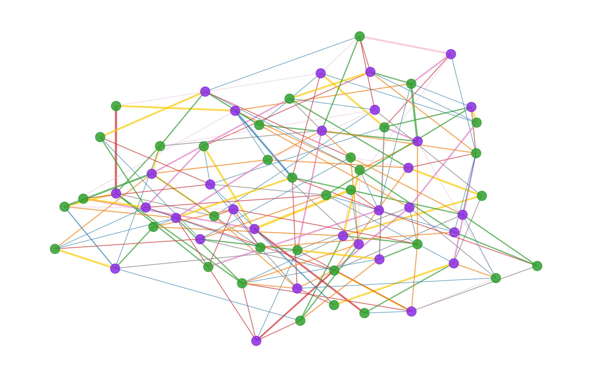
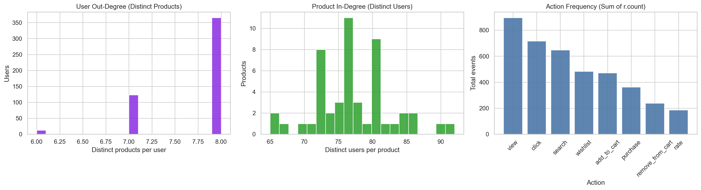
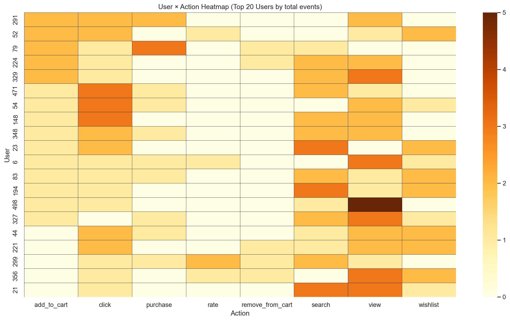

## 4. Câu 2b — Knowledge Base Graph (KB_Graph)

### 4.1 Giải Thích Kiến Trúc KB Graph

KB_Graph mô hình hóa hệ thống E‑Commerce của nhóm dưới dạng một **đồ thị tri thức (Knowledge Graph) bipartite**, trong đó hai loại node là `User` và `Product` được liên kết thông qua các cạnh mang thông tin **hành vi (action type)** và **trọng số (weight)** tương ứng với mức độ tương tác. Mục tiêu của KB_Graph là (i) lưu trữ lịch sử tương tác dưới dạng đồ thị để truy vấn nhanh, (ii) phục vụ các bài toán phân tích hành vi, và (iii) cung cấp tín hiệu cho các thuật toán gợi ý theo hướng Collaborative Filtering/Graph‑based scoring.

- **Node Users (màu tím)**: Đại diện cho khách hàng trong hệ thống. Tập dữ liệu hiện tại trong Neo4j có **500 users**.
- **Node Products (màu xanh lá)**: Đại diện cho sản phẩm trong catalog. Tập dữ liệu hiện tại trong Neo4j có **50 products**.
- **Edges (màu theo loại hành vi)**: `view`, `click`, `add_to_cart`, `purchase`, `search`, `wishlist`, `remove_from_cart`, `rate`.
- **Edge Weight**: Được tính theo **điểm tương tác tích lũy**. Với mỗi cặp `(user_id, product_id, action)`, hệ thống aggregate số lần tương tác `count` và quy đổi thành trọng số tổng `weight` để phản ánh mức độ quan tâm của user tới product theo từng hành vi.

**Bảng màu hành vi (chuẩn hóa trong báo cáo)**

- **view** (xanh dương)
- **click** (đỏ)
- **add_to_cart** (xanh lá)
- **purchase** (vàng)
- **search** (cam)
- **wishlist** (xám)
- **remove_from_cart** (hồng nhạt)
- **rate** (hồng đậm)

**Thang điểm trọng số theo hành vi (base weight)**  
Các base weight sử dụng trong hệ thống báo cáo này:

- `remove_from_cart`: 1.0 (ít giá trị nhất)
- `view`: 1.5
- `click`: 2.0
- `wishlist`: 2.0
- `search`: 2.5
- `add_to_cart`: 3.0
- `rate`: 3.5
- `purchase`: 4.5 (quan trọng nhất)

Trong Neo4j, `weight` là tổng tích lũy theo thời gian, tức:
\[
weight(u,p,action) = base\_weight(action) \times count(u,p,action)
\]

**Schema Neo4j (production)**

- `(:User {id})`
- `(:Product {id})`
- `(u)-[:INTERACTS_WITH {action, count, first_ts, last_ts, weight}]->(p)`

**Công nghệ triển khai**

- **NetworkX**: xây dựng và xử lý đồ thị ở tầng phân tích/experiment.
- **PyVis**: trực quan hóa đồ thị dạng HTML tương tác.
- **Neo4j**: graph database production để lưu trữ và truy vấn bằng Cypher.

### 4.2 Biểu Đồ KB Graph — User-Product Interaction Network

**Hình 5.1**: KB_Graph Network — **30 users × 34 products × các edges nổi bật** (subgraph). Bipartite graph cho phép quan sát các cụm (cluster) tương tác: nhóm users có hành vi tương đồng thường liên kết tới các products tương tự. Độ dày của cạnh phản ánh tổng `weight`, trong đó các cạnh liên quan tới `purchase` thường có độ dày cao hơn và thể hiện sức mua/ý định mua mạnh.

- Static PNG: `plots/kb_graph_network.png`
- Interactive HTML: `kb_graph.html`



### 4.3 Thống Kê Topology Đồ Thị

**Hình 5.2**: KB_Graph Statistics — gồm 3 thành phần:

- **User Out‑Degree distribution**: số lượng sản phẩm (distinct) mà một user đã tương tác.
- **Product In‑Degree distribution**: số lượng users (distinct) đã tương tác với một product.
- **Action Frequency**: tần suất hành vi (tổng `sum(r.count)`), cho thấy hành vi nào chiếm ưu thế trong hệ thống.



### 4.4 User × Action Heatmap (Top 20 Users)

**Hình 5.3**: Heatmap hành vi của **20 users hoạt động nhiều nhất** (xếp theo tổng số event `sum(r.count)`). Màu vàng biểu thị mức độ tương tác cao nhất. Quan sát thường thấy `view` là hành vi chiếm ưu thế, theo sau là `click` và `search`, phản ánh phễu hành vi điển hình: xem → nhấp → tìm kiếm → thêm giỏ → mua.



### 4.5 Dữ Liệu Mẫu 20 Cạnh (Edge Matrix)

Bảng 5.1: 20 cạnh mẫu từ KB_Graph (top theo `weight`). Mỗi dòng thể hiện một quan hệ `User → Product` kèm loại hành vi (`edge_type`) và trọng số tổng (`weight`) dùng trong scoring/gợi ý.

| source_user | target_product | weight | edge_type |
| --- | --- | --- | --- |
| User 181 | Product 38 | 9.0 | purchase |
| User 320 | Product 41 | 9.0 | purchase |
| User 296 | Product 28 | 9.0 | purchase |
| User 368 | Product 10 | 6.0 | add_to_cart |
| User 288 | Product 28 | 5.0 | search |
| User 289 | Product 15 | 5.0 | search |
| User 78 | Product 47 | 5.0 | search |
| User 102 | Product 9 | 4.5 | purchase |
| User 416 | Product 22 | 4.5 | purchase |
| User 492 | Product 22 | 4.5 | purchase |
| User 299 | Product 11 | 4.5 | purchase |
| User 206 | Product 9 | 4.5 | purchase |
| User 223 | Product 9 | 4.5 | purchase |
| User 254 | Product 9 | 4.5 | purchase |
| User 488 | Product 22 | 4.5 | purchase |
| User 334 | Product 11 | 4.5 | purchase |
| User 256 | Product 22 | 4.5 | purchase |
| User 291 | Product 11 | 4.5 | purchase |
| User 42 | Product 11 | 4.5 | purchase |
| User 291 | Product 9 | 4.5 | purchase |

### 4.6 Cypher Query Mẫu (Neo4j)

#### Tạo node và edge (theo API realtime)

```cypher
MERGE (u:User {id: $user_id})
MERGE (p:Product {id: $product_id})
MERGE (u)-[r:INTERACTS_WITH {action: $action}]->(p)
ON CREATE SET
  r.count = 1,
  r.first_ts = $event_ts,
  r.last_ts = $event_ts,
  r.weight = $action_weight
ON MATCH SET
  r.count = r.count + 1,
  r.last_ts = $event_ts,
  r.weight = r.weight + $action_weight;
```

#### Truy vấn sản phẩm tương tự (collaborative filtering theo shared users)

```cypher
MATCH (u:User)-[:INTERACTS_WITH]->(p:Product {id: $product_id})
MATCH (u)-[:INTERACTS_WITH]->(similar:Product)
WHERE similar.id <> $product_id
RETURN similar.id AS product_id, COUNT(DISTINCT u) AS shared_users
ORDER BY shared_users DESC
LIMIT 5;
```

#### Truy vấn sản phẩm tương tự (phiên bản có trọng số)

```cypher
MATCH (u:User)-[r1:INTERACTS_WITH]->(p:Product {id: $product_id})
MATCH (u)-[r2:INTERACTS_WITH]->(similar:Product)
WHERE similar.id <> $product_id
WITH similar, sum(r1.weight + r2.weight) AS score, COUNT(DISTINCT u) AS shared_users
RETURN similar.id AS product_id, shared_users, score
ORDER BY score DESC
LIMIT 5;
```
